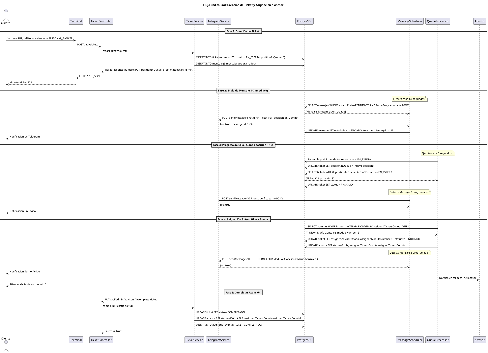
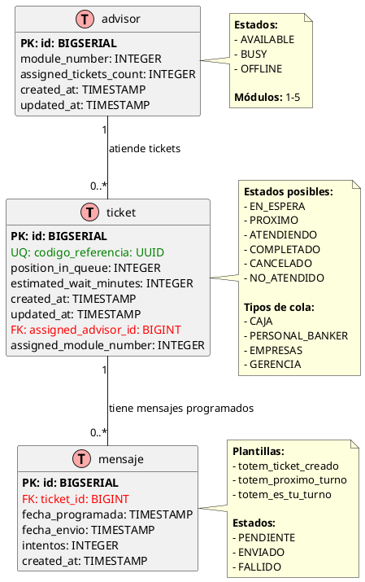

# Arquitectura de Software - Sistema Ticketero Digital

**Proyecto:** Sistema de Gestión de Tickets con Notificaciones en Tiempo Real  
**Versión:** 1.0  
**Fecha:** Diciembre 2025  
**Arquitecto:** Arquitecto de Software Senior

---

## 1. Resumen Ejecutivo

El Sistema Ticketero Digital moderniza la experiencia de atención en sucursales bancarias mediante digitalización completa del proceso de tickets, notificaciones automáticas vía Telegram, y asignación inteligente de clientes a ejecutivos. La arquitectura propuesta utiliza tecnologías maduras y probadas, priorizando simplicidad y mantenibilidad para el volumen esperado de 25,000 tickets/día.

**Principios Arquitectónicos:**
- **Simplicidad 80/20:** Tecnologías maduras sobre bleeding-edge
- **Escalabilidad Gradual:** Diseño que soporta crecimiento por fases
- **Observabilidad:** Logging y métricas integradas
- **Resiliencia:** Reintentos automáticos y manejo de fallos

---

## 2. Stack Tecnológico

### 2.1 Backend Framework

**Selección:** Java 21 + Spring Boot 3.2.11

**Justificación:**

#### ¿Por qué Java 21?
- **Virtual Threads (Project Loom):** Manejo eficiente de concurrencia para schedulers que procesan miles de mensajes
- **Records:** DTOs inmutables sin boilerplate (TicketRequest, TicketResponse)
- **Pattern Matching:** Código más limpio para validaciones y transformaciones
- **LTS (Long Term Support):** Soporte hasta 2029, crítico para sistemas financieros
- **Ecosistema maduro:** Amplia adopción en sector bancario (95% de instituciones)

#### ¿Por qué Spring Boot 3.2.11?
- **Spring Data JPA:** Reducción de 80% de código de acceso a datos
- **Spring Scheduling:** @Scheduled para procesamiento asíncrono de mensajes
- **Bean Validation:** Validación declarativa con @Valid
- **Actuator:** Endpoints de salud y métricas out-of-the-box
- **Configuración por convención:** Desarrollo rápido y mantenible

#### Alternativas Consideradas:

| Tecnología      | Pros                          | Contras                           | Decisión |
|-----------------|-------------------------------|-----------------------------------|----------|
| Node.js + NestJS| Async nativo, menor footprint | Menos maduro para apps críticas   | ❌ No    |
| Go + Gin        | Performance superior          | Ecosistema menos maduro para CRUD | ❌ No    |
| .NET Core       | Excelente tooling             | Licenciamiento, menos adopción    | ❌ No    |

### 2.2 Base de Datos

**Selección:** PostgreSQL 16

**Justificación:**

#### ¿Por qué PostgreSQL 16?
- **ACID compliant:** Crítico para transacciones financieras (creación de tickets, asignaciones)
- **JSONB:** Flexibilidad para almacenar metadata de mensajes y auditoría
- **Índices avanzados:** B-tree, GiST para queries complejas de posición en cola
- **Row-level locking:** Concurrencia para asignación simultánea de tickets
- **Particionamiento:** Escalabilidad para auditoría (millones de registros)
- **Open source:** Sin costos de licenciamiento

#### Alternativas Consideradas:

| Base de Datos | Pros                    | Contras                      | Decisión |
|---------------|-------------------------|------------------------------|----------|
| MySQL         | Amplia adopción         | Menor soporte de JSON        | ❌ No    |
| MongoDB       | Flexible schema         | No ACID para múltiples docs  | ❌ No    |
| Oracle        | Features empresariales  | Costos prohibitivos          | ❌ No    |

### 2.3 Migraciones de Base de Datos

**Selección:** Flyway

**Justificación:**

#### ¿Por qué Flyway?
- **Versionamiento automático:** Control de cambios de esquema en producción
- **Rollback seguro:** Reversión controlada de migraciones
- **Integración nativa:** Spring Boot auto-configuración
- **Validación de checksums:** Detecta cambios manuales no autorizados
- **Simplicidad:** Archivos SQL planos (V1__Create_tickets.sql, V2__Add_advisors.sql)

#### Alternativa:
- **Liquibase:** Más verboso (XML/YAML), overkill para este proyecto

### 2.4 Integración con Telegram

**Selección:** Telegram Bot HTTP API + RestTemplate

**Justificación:**

#### ¿Por qué Telegram Bot API?
- **Canal preferido:** Especificado por el cliente
- **API HTTP simple:** Bien documentada y estable
- **Sin costo:** vs WhatsApp Business API ($0.005/mensaje)
- **Rate limits generosos:** 30 mensajes/segundo
- **Soporte HTML:** Mensajes enriquecidos con formato

#### ¿Por qué RestTemplate (no WebClient)?
- **Simplicidad:** API síncrona más fácil de debuggear
- **Volumen bajo:** 25,000 tickets/día × 3 mensajes = 75,000 mensajes/día = 0.9 msg/segundo
- **Stack trace claro:** Debugging más simple para el equipo
- **WebClient (reactivo):** Overkill para este throughput

### 2.5 Containerización

**Selección:** Docker + Docker Compose

**Justificación:**

#### ¿Por qué Docker?
- **Paridad dev/prod:** "Funciona en mi máquina" → "Funciona en todas"
- **Multi-stage builds:** Imagen final optimizada <150MB
- **Aislamiento:** Dependencias encapsuladas
- **Estándar industria:** 90% adopción en empresas

#### ¿Por qué Docker Compose?
- **Orquestación simple:** Ideal para dev/staging
- **Definición declarativa:** PostgreSQL + API en un archivo
- **Redes automáticas:** Comunicación entre contenedores
- **Migración fácil:** A ECS/Fargate en AWS para producción

### 2.6 Build Tool

**Selección:** Maven 3.9+

**Justificación:**

#### ¿Por qué Maven?
- **Convención sobre configuración:** Estructura estándar de proyecto
- **Repositorio central:** 10M+ artifacts disponibles
- **Plugins maduros:** Spring Boot Maven Plugin, Flyway Plugin
- **Estándar empresarial:** Amplia adopción en sector financiero
- **Gestión de dependencias:** Resolución automática de conflictos

#### Alternativa:
- **Gradle:** Más flexible pero mayor curva de aprendizaje

---

## 3. Validaciones del Stack

### 3.1 Checklist de Completitud
- ✅ 6 tecnologías seleccionadas y justificadas
- ✅ Cada selección tiene tabla de alternativas con pros/contras
- ✅ Justificaciones técnicamente sólidas
- ✅ Contexto empresarial considerado (sector financiero)
- ✅ Volumen de negocio analizado (25K tickets/día)
- ✅ Principio 80/20 aplicado (simplicidad sobre complejidad)

### 3.2 Alineación con Requerimientos
- ✅ **RNF-003 Escalabilidad:** Fase Piloto → Nacional soportada
- ✅ **RNF-004 Confiabilidad:** PostgreSQL ACID + reintentos automáticos
- ✅ **RNF-005 Seguridad:** Bean Validation + PostgreSQL row-level security
- ✅ **RNF-007 Mantenibilidad:** Spring Boot + Maven + Docker

---

## 4. Diagramas de Arquitectura

### 4.1 Diagrama de Contexto C4

El siguiente diagrama muestra el sistema Ticketero en su contexto, incluyendo actores externos y sistemas con los que interactúa.

```plantuml
@startuml Diagrama de Contexto - Sistema Ticketero
!include https://raw.githubusercontent.com/plantuml-stdlib/C4-PlantUML/master/C4_Context.puml

title Diagrama de Contexto (C4 Level 1) - Sistema Ticketero

' Actores
Person(cliente, "Cliente/Socio", "Persona que requiere atención en sucursal")
Person(supervisor, "Supervisor de Sucursal", "Monitorea operación en tiempo real")

' Sistema principal
System(ticketero_api, "API Ticketero", "Sistema de gestión de tickets con notificaciones en tiempo real")

' Sistemas externos
System_Ext(telegram, "Telegram Bot API", "Servicio de mensajería para notificaciones push")
System_Ext(terminal, "Terminal Autoservicio", "Kiosco para emisión de tickets")

' Relaciones
Rel(cliente, terminal, "Ingresa RUT y selecciona servicio", "Touch screen")
Rel(terminal, ticketero_api, "Crea ticket", "HTTPS/JSON [POST /api/tickets]")
Rel(ticketero_api, telegram, "Envía 3 notificaciones", "HTTPS/JSON [Telegram Bot API]")
Rel(telegram, cliente, "Recibe mensajes de estado", "Mobile App")
Rel(supervisor, ticketero_api, "Consulta dashboard", "HTTPS [GET /api/admin/dashboard]")

SHOW_LEGEND()

@enduml
```

**Descripción de Elementos:**
- **Actores:** Cliente (usuario final), Supervisor (monitoreo operacional)
- **Sistema Principal:** API Ticketero (core del sistema)
- **Sistemas Externos:** Telegram Bot API (notificaciones), Terminal Autoservicio (interfaz cliente)
- **Protocolos:** HTTPS/JSON para todas las comunicaciones

**Archivo fuente:** `docs/diagrams/01-context-diagram.puml`

### 4.2 Diagrama de Secuencia

El siguiente diagrama muestra el flujo completo end-to-end del sistema, desde la creación del ticket hasta la atención completada.



**Descripción de las Fases:**
1. **Fase 1:** Cliente crea ticket en terminal, sistema calcula posición real
2. **Fase 2:** Scheduler envía confirmación inmediata vía Telegram
3. **Fase 3:** Sistema monitorea progreso, envía pre-aviso cuando posición ≤ 3
4. **Fase 4:** Asignación automática a asesor disponible, envía notificación final
5. **Fase 5:** Asesor completa atención, sistema libera recursos

**Archivo fuente:** `docs/diagrams/02-sequence-diagram.puml`

### 4.3 Modelo de Datos ER

El siguiente diagrama muestra el modelo entidad-relación de la base de datos PostgreSQL.



**Descripción de las Relaciones:**
- **ticket ← mensaje (1:N):** Un ticket puede tener múltiples mensajes programados (confirmación, pre-aviso, turno activo)
- **advisor ← ticket (1:N):** Un asesor puede atender múltiples tickets (pero solo 1 a la vez en estado ATENDIENDO)

**Índices Importantes:**
- `ticket.codigo_referencia` (UNIQUE): Búsqueda rápida por UUID
- `ticket.numero` (UNIQUE): Búsqueda por número de ticket
- `ticket.national_id`: Validación de ticket activo por cliente
- `ticket.status`: Filtrado de tickets por estado
- `mensaje.estado_envio + fecha_programada`: Query del scheduler
- `advisor.status`: Selección de asesores disponibles

**Archivo fuente:** `docs/diagrams/03-er-diagram.puml`

---

## 5. Arquitectura en Capas

### 5.1 Diagrama de Capas

```
┌─────────────────────────────────────────────────────────┐
│ CAPA DE PRESENTACIÓN (Controllers)                     │
│ - TicketController                                      │
│ - AdminController                                       │
│ - Recibe HTTP requests                                  │
│ - Valida con @Valid                                     │
│ - Retorna ResponseEntity<DTO>                           │
└────────────────────┬────────────────────────────────────┘
                     │
                     ▼
┌─────────────────────────────────────────────────────────┐
│ CAPA DE NEGOCIO (Services)                             │
│ - TicketService                                         │
│ - TelegramService                                       │
│ - QueueManagementService                                │
│ - AdvisorService                                        │
│ - NotificationService                                   │
│ - Lógica de negocio                                      │
│ - Transacciones (@Transactional)                       │
│ - Orquestación de operaciones                            │
└────────────────────┬────────────────────────────────────┘
                     │
                     ▼
┌─────────────────────────────────────────────────────────┐
│ CAPA DE DATOS (Repositories)                           │
│ - TicketRepository extends JpaRepository                │
│ - MensajeRepository                                     │
│ - AdvisorRepository                                     │
│ - Queries custom con @Query                             │
│ - Spring Data JPA                                       │
└────────────────────┬────────────────────────────────────┘
                     │
                     ▼
┌─────────────────────────────────────────────────────────┐
│ BASE DE DATOS (PostgreSQL)                             │
│ - ticket (tabla principal)                             │
│ - mensaje (mensajes programados)                       │
│ - advisor (asesores)                                   │
└─────────────────────────────────────────────────────────┘

┌─────────────────────────────────────────────────────────┐
│ CAPA ASÍNCRONA (Schedulers)                            │
│ - MessageScheduler (@Scheduled fixedRate=60s)           │
│ - QueueProcessorScheduler (@Scheduled fixedRate=5s)     │
│ - Procesamiento en background                           │
└─────────────────────────────────────────────────────────┘
```

### 5.2 Responsabilidades por Capa

#### 1. Controllers (Capa de Presentación)
**Responsabilidad:** Manejar HTTP requests/responses  
**Prohibido:** Lógica de negocio, acceso directo a DB

```java
@RestController
@RequestMapping("/api/tickets")
public class TicketController {
    
    @PostMapping
    public ResponseEntity<TicketResponse> crearTicket(@Valid @RequestBody TicketRequest request) {
        // 1. Validar (automático con @Valid)
        // 2. Delegar a service
        // 3. Retornar response
    }
}
```

#### 2. Services (Capa de Negocio)
**Responsabilidad:** Lógica de negocio, transacciones, orquestación  
**Prohibido:** Lógica de presentación (HTTP codes), SQL directo

```java
@Service
@Transactional
public class TicketService {
    
    public TicketResponse crearTicket(TicketRequest request) {
        // 1. Validar reglas de negocio (RN-001: único ticket activo)
        // 2. Generar número de ticket
        // 3. Calcular posición (RN-010)
        // 4. Persistir ticket
        // 5. Programar 3 mensajes
        // 6. Registrar auditoría (RN-011)
        // 7. Retornar response
    }
}
```

#### 3. Repositories (Capa de Datos)
**Responsabilidad:** Acceso a datos, queries  
**Prohibido:** Lógica de negocio

```java
@Repository
public interface TicketRepository extends JpaRepository<Ticket, Long> {
    
    @Query("SELECT t FROM Ticket t WHERE t.status = :status ORDER BY t.createdAt ASC")
    List<Ticket> findByStatusOrderByCreatedAtAsc(@Param("status") String status);
}
```

#### 4. Schedulers (Capa Asíncrona)
**Responsabilidad:** Procesamiento en background  
**Prohibido:** HTTP requests directos de clientes

```java
@Component
public class MessageScheduler {
    
    @Scheduled(fixedRate = 60000) // Cada 60 segundos
    public void procesarMensajesPendientes() {
        // 1. Buscar mensajes con estado=PENDIENTE y fechaProgramada <= NOW
        // 2. Enviar vía TelegramService
        // 3. Actualizar estado a ENVIADO/FALLIDO
    }
}
```

---

## 6. Componentes Principales

### 6.1 TicketController
**Responsabilidad:** Exponer API REST para gestión de tickets

**Endpoints:**
- `POST /api/tickets` - Crear ticket (RF-001)
- `GET /api/tickets/{uuid}` - Obtener ticket (RF-006)
- `GET /api/tickets/{numero}/position` - Consultar posición (RF-003)

**Dependencias:** TicketService

### 6.2 AdminController
**Responsabilidad:** Panel administrativo para supervisores

**Endpoints:**
- `GET /api/admin/dashboard` - Dashboard completo (RF-007)
- `GET /api/admin/queues/{type}` - Estado de cola (RF-005)
- `PUT /api/admin/advisors/{id}/status` - Cambiar estado asesor

**Dependencias:** QueueManagementService, AdvisorService

### 6.3 TicketService
**Responsabilidad:** Lógica de negocio para tickets

**Métodos Principales:**
- `crearTicket(TicketRequest)` → TicketResponse
- `obtenerPosicionEnCola(String numero)` → QueuePositionResponse

**Reglas de Negocio:** RN-001, RN-005, RN-006, RN-010, RN-011

### 6.4 TelegramService
**Responsabilidad:** Integración con Telegram Bot API

**Métodos:**
- `enviarMensaje(String chatId, String texto)` → String messageId
- `obtenerTextoMensaje(String plantilla, String numeroTicket)` → String

### 6.5 MessageScheduler
**Responsabilidad:** Envío asíncrono de mensajes programados

**Configuración:** @Scheduled(fixedRate = 60000)

### 6.6 QueueProcessorScheduler
**Responsabilidad:** Procesamiento automático de colas

**Configuración:** @Scheduled(fixedRate = 5000)

---

## 7. Decisiones Arquitectónicas (ADRs)

### ADR-001: No usar Circuit Breakers (Resilience4j)

**Contexto:** Telegram Bot API es un servicio externo que podría fallar.

**Decisión:** NO implementar Circuit Breaker en esta fase.

**Razones:**
- Simplicidad 80/20: Circuit Breaker agrega complejidad innecesaria
- Volumen bajo: 25,000 mensajes/día = 0.3 msg/segundo (no crítico)
- Telegram tiene 99.9% uptime
- Reintentos simples (RN-007, RN-008) son suficientes

**Consecuencias:**
- ✅ Código más simple y mantenible
- ✅ Menor curva de aprendizaje
- ❌ Sin protección contra cascading failures (aceptable para este volumen)

**Futuro:** Fase 2 (50+ sucursales): reevaluar Resilience4j

### ADR-002: RestTemplate en lugar de WebClient

**Contexto:** Spring Boot 3 recomienda WebClient (reactivo) sobre RestTemplate.

**Decisión:** Usar RestTemplate (blocking I/O).

**Razones:**
- Simplicidad: API síncrona más fácil de debuggear
- Volumen bajo: 0.3 requests/segundo a Telegram
- WebClient requiere Project Reactor (curva de aprendizaje)

**Consecuencias:**
- ✅ Código más simple
- ✅ Stack trace más fácil de leer
- ❌ Menor throughput (no relevante para este caso)

### ADR-003: Scheduler en lugar de Queue (RabbitMQ/Kafka)

**Contexto:** Mensajes deben enviarse en tiempos específicos.

**Decisión:** Usar @Scheduled + tabla mensaje en PostgreSQL.

**Razones:**
- Simplicidad: no requiere infraestructura adicional
- Volumen bajo: 75,000 mensajes/día = 0.9 msg/segundo
- PostgreSQL como "queue" es confiable (ACID)

**Consecuencias:**
- ✅ Infraestructura simple (solo PostgreSQL + API)
- ❌ Polling cada 60s (no tiempo real extremo, aceptable)

### ADR-004: Flyway para Migraciones

**Decisión:** Usar Flyway en lugar de Liquibase.

**Razones:**
- SQL plano (fácil de leer y mantener)
- Versionamiento automático
- Integración nativa con Spring Boot

### ADR-005: Bean Validation (@Valid) en DTOs

**Decisión:** Validar requests con Bean Validation.

**Razones:**
- Declarativo: @NotBlank, @Pattern directamente en DTOs
- Spring lo valida automáticamente con @Valid
```